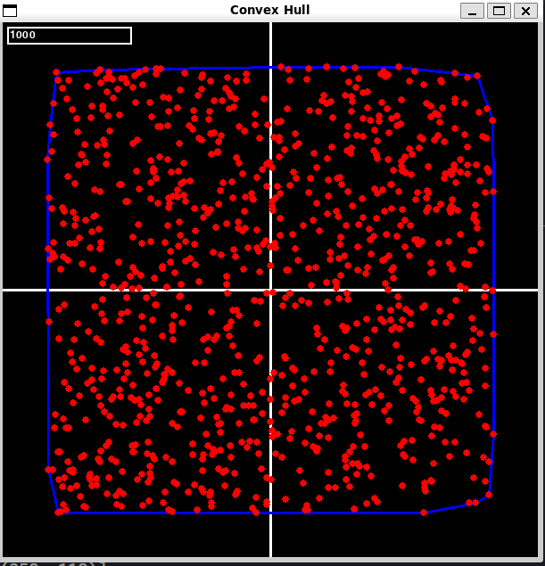
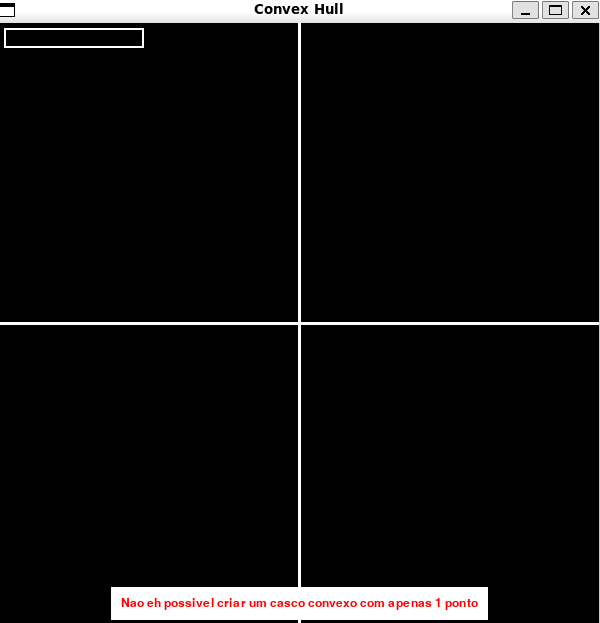
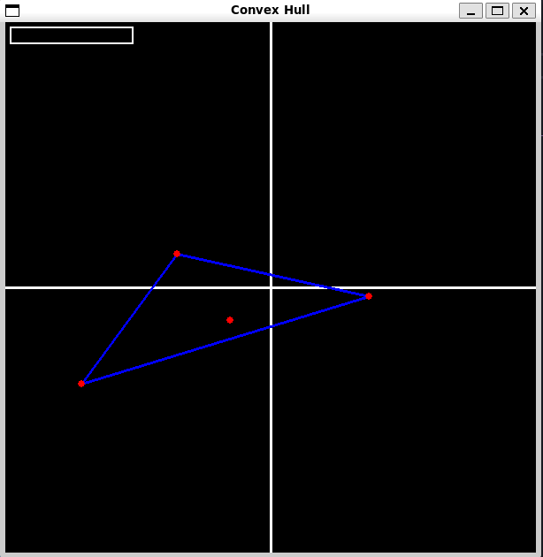

# D&C_DC_ConvexHull

**Número da Lista**: 28<br>
**Conteúdo da Disciplina**: Dividir e Conquistar<br>

## Alunos
|Matrícula | Aluno |
| -- | -- |
| 19/0042419  |  Davi Matheus da Rocha de Oliveira |
| 19/0058650  |  Natanael Fernandes Coelho Filho |

## Sobre 
Neste projeto, utilizamos o problema do Fecho Convexo (Convex Hull) e implementamos utilizando a biblioteca Pygame para facilitar a geração de pontos aleatórios. Utilizamos o algoritmo QuickHull, um algoritmo de Divisão e Conquista similar ao QuickSort. O objetivo do programa é encontrar o menor polígono convexo que contém todos os pontos dados, ou seja, a fronteira mínima do polígono convexo que abrange todos os pontos.

Basicamente Esse código cria uma interface gráfica onde o usuário pode inserir a quantidade de pontos desejada, e em seguida, o algoritmo QuickHull é usado para calcular e exibir o convex hull correspondente.

[link](https://youtu.be/latiFwJ8soU) para vídeo de execução

## Screenshots





## Instalação 
**Linguagem**: Python<br>
**Framework**: Nenhum<br>

python main.py

## Uso 

Antes de executar o programa, certifique-se de ter o Python 3 instalado em seu sistema. Você pode fazer o download da versão mais recente do Python em python.org.

### Instalação de Requisitos

O programa requer algumas dependências que devem ser instaladas, desta forma siga as etapas abaixo:

1. Abra o terminal e navegue até o diretório do projeto.

2. Execute o seguinte comando para instalar as dependências:

```shell
pip install -r requirements.txt
# Isso garantirá que todas as bibliotecas necessárias sejam instaladas corretamente.
```

## Executando o Programa

Após ter instalado os requisitos, você pode executar o programa seguindo estas etapas:

1. Execute o seguinte comando para iniciar o programa:

```shell
python3 main.py
```

2. Quando a tela tiver começado ao canto superior esquerdo terá um quadrado o qual é um campo de input.

3. Insira a quantidade de pontos desejados e pressione a tecla ENTER

4. Espere o calculo ser finalizado e será apresentado o resultado do casco convexo na tela do pygame.

5. O passo a passo anterior pode ser repetido quantas vezes você quiser

*Observação:* Não recomendo inserir um número maior que 10mil, pois pode demorar muito e gerar problemas ao seu computador.

## Outros 
Para iniciar a geração de pontos, clique na caixa localizada no canto superior esquerdo e digite a quantidade de pontos desejada.
O recomandado é que coloque no "Maximo" 10000 ja que acima disso vai demorar muito para fazer o calculo, demandando muito do processo.


